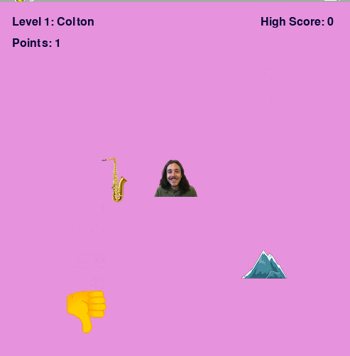

# I Am The Mountain: Denigrate Pygame

**I Am The Mountain: Denigrate** is a music-themed game based on the Calgary band *I Am the Mountain*. This game features their song "Denigrate" as the background music. As a player, you take on the role of different band members, collect their instruments, avoid boos (thumbs down), and progress through multiple levels. It's a quirky, fun way to experience the band while navigating through challenges!




## Features

- Background music: "Denigrate" by *I Am the Mountain*.
- Play as different band members with unique instruments.
- Navigate using the arrow keys to collect instruments and avoid obstacles.
- Increase points by collecting mountains (cheers) and progressing through six levels.
- A variety of sound effects like cheers for correct actions and boos when you lose points.
- High score tracking.

## How to Play

- Use the arrow keys to move your character left, right, up, and down.
- Collect instruments and mountains (cheers) to score points.
- Avoid thumbs down (boos), which reset your points if you collide with them.
- Progress through levels by scoring points. Each level changes your character and instrument:
  - Level 1: Colton with the saxophone
  - Level 2: Keath with the trumpet
  - Level 3: Rob with drums
  - Level 4: Jesse with bass
  - Level 5: Dylan with trombone
  - Level 6: Jay with guitar
- Reach 120 points to win the game!

## Controls

- **Arrow Keys**: Move your character.
- **Esc**: Quit the game.

## Installation

1. Make sure you have Python and Pygame installed:
   ```bash
   pip install pygame
   ```
2. Download or clone the repository.
3. Run the game:
   ```bash
   python3 musicgame.py
   ```
